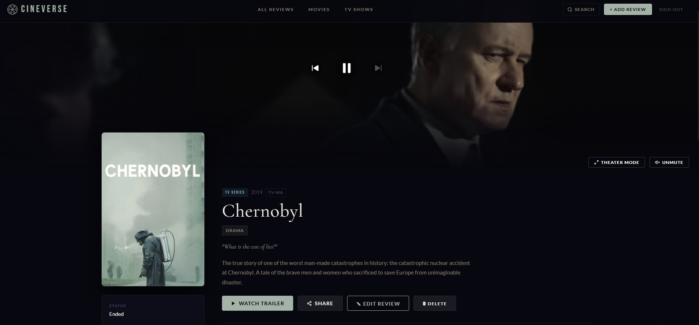
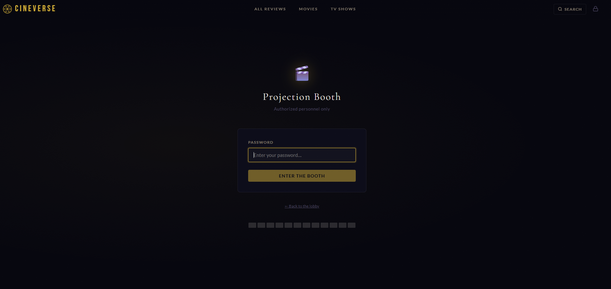
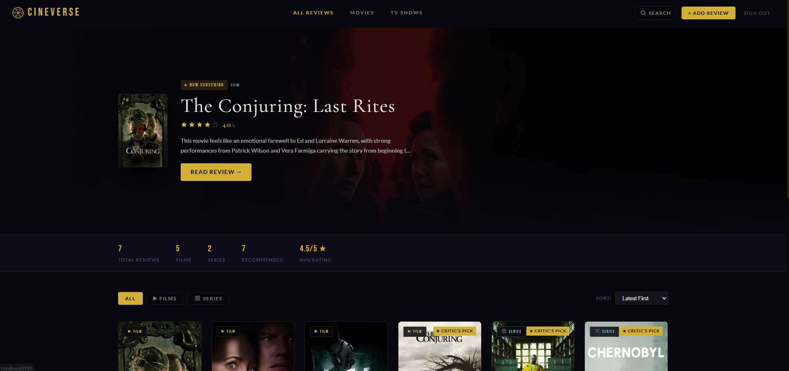

# 🎬 CineVerse - A Cinematic Review Journal

> A personal movie & TV review website with a cinematic, immersive experience. Powered by the TMDB API.

---

## ✨ Features

### 🎥 Cinematic Trailer Integration
- **Netflix-Style Hero Banner** - Every movie/show detail page opens with an auto-playing, muted YouTube trailer filling the entire header. A prominent **Unmute** button and volume slider let you dive in immediately.
- **Theater Mode** - A dedicated "Watch Trailer" button dims the entire page to 90% black and centers the player for a distraction-free experience. Press `ESC` or click outside to exit.

### 🎨 Adaptive UI/UX
- **Dynamic Color Palettes** - Uses [ColorThief](https://lokeshdhakar.com/projects/color-thief/) to extract the dominant colors from the official movie poster, then dynamically updates accent colors, button highlights, and background gradients to perfectly match the film being viewed.
- **Film Grain Overlay** - A canvas-based animated film grain texture rendered over the entire page for an authentic cinematic feel.




### 🔐 Admin-Only Reviews
- Password-protected admin session (session-scoped, clears on browser close).
- Only the admin can write, edit, or delete reviews. Visitors have read-only access.
- Review form includes: **5-star rating**, **headline**, **full review text**, **watched date**, **recommended toggle**, and a **spoiler warning** flag.
- Spoiler-tagged reviews are blurred for visitors, with a one-click reveal.



### 🗂 Review Management
- Filter by **Films** or **TV Series**, sort by **Latest**, **Highest Rated**, or **A–Z**.
- Reviews persist in `localStorage` - no backend required.
- **Critic's Pick** badge automatically awarded to titles rated 4.5★ or above.
- Stats bar shows total reviews, film/series count, recommendations, and average rating.



### 🎞 Extra Cinematic Touches
- Cast carousel with profile photos pulled from TMDB.
- "You Might Also Like" similar titles section.
- Quick-facts sidebar: runtime, budget, revenue, content rating, director/writer.
- Share button copies the page URL to clipboard.
- Reading time estimator on reviews.
- Responsive design - works on mobile, tablet, and desktop.

---

## 📁 Project Structure

```
src/
├── components/
│   ├── CastCarousel.jsx     # Horizontal scrollable cast list
│   ├── FilmGrain.jsx        # Animated canvas film grain overlay
│   ├── HeroBanner.jsx       # Auto-playing YouTube trailer hero
│   ├── MovieCard.jsx        # Review card for the grid
│   ├── Navbar.jsx           # Navigation + search trigger
│   ├── ReviewForm.jsx       # Admin-only review editor
│   ├── SearchModal.jsx      # TMDB search overlay
│   ├── StarRating.jsx       # Interactive & read-only star rating
│   └── TheaterMode.jsx      # Fullscreen theater overlay
├── context/
│   ├── AdminContext.jsx     # Admin auth state
│   └── ThemeContext.jsx     # Dynamic ColorThief palette
├── pages/
│   ├── AdminLogin.jsx       # Password gate
│   ├── Home.jsx             # Review grid + featured hero
│   └── MovieDetail.jsx      # Full detail + trailer + review page
├── utils/
│   ├── storage.js           # localStorage CRUD for reviews
│   └── tmdb.js              # TMDB API wrapper functions
├── config.js                # API keys, image URL helpers
├── App.jsx                  # Routing setup
└── index.css                # Global styles & CSS variables
```

---

## 🌐 Deployment

This app is deployed in Vercel under the link: [CineVerse on Vercel](https://cineverse-ruddy-three.vercel.app/)

---

## 📝 License

MIT - personal use, fork freely.

---

*Built with React + Vite. Data from [The Movie Database (TMDB)](https://www.themoviedb.org). This product uses the TMDB API but is not endorsed or certified by TMDB.*
